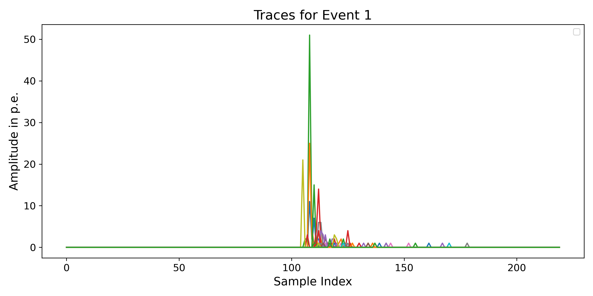
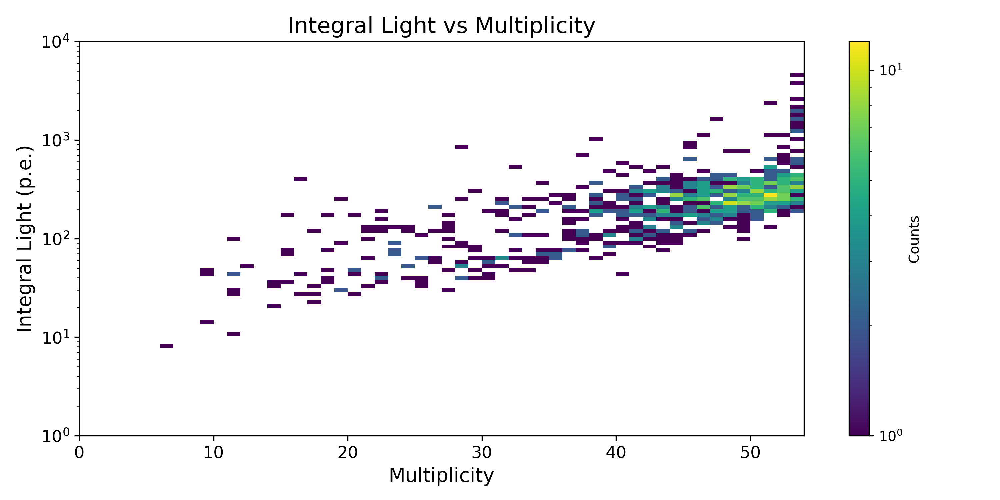

# External multiplicity-based triggers (muon veto)

This tutorial shows how to use the functions in `reboost.pmts` to apply a
multiplicity-based trigger scheme similar to the LEGEND muon veto. This is
especially useful for external veto systems with an independent DAQ or trigger
system that is detached from the main detector system. The hit building in this
tutorial is independent from the main _reboost_ hit building or TCM handling,
but the resulting veto information can still be applied to the main detector
processing chain.

Two workflows are shown below. The first processes the veto data without using
the TCM and therefore only reconstructs the response of the external veto
system. The second uses the TCM built by _reboost_ to apply the veto response to
hits in the main detectors.

The example uses the LEGEND-200 muon veto, but the same logic can be used for
any multiplicity-based trigger system.

## Isolated event building

### Reading the data

Isolated event building only requires the input `stp` file from _remage_. For
the LEGEND muon veto we are only interested in the PMT detectors, so we iterate
over all detectors and keep the ones whose name contains `pmt`. The same filter
can also be used to exclude detectors, for example broken PMTs.

```python
import awkward as ak
import numpy as np
import lh5

stp_file = "..."  # (adjust this)
stps = lh5.read("stp", stp_file)

records = []
lengths = []
for det, table in stps.items():
    if "pmt" not in det.lower():
        continue

    ak_table = table.view_as("ak", with_units=True)
    if ak_table.time.ndim == 2:
        evtid, time = ak.broadcast_arrays(ak_table.evtid, ak_table.time)
        time = ak.with_parameter(
            ak.flatten(ak_table.time),
            "units",
            ak.parameters(ak_table.time)["units"],
        )
        flat_table = ak.zip(
            {
                "evtid": ak.flatten(evtid),
                "time": time,
            }
        )
    else:
        flat_table = ak_table

    records.append(flat_table)
    lengths.append(len(flat_table))

# Concatenating and unflattening is faster than creating ak.Array(records) directly.
flat = ak.concatenate(records)
input_arr = ak.unflatten(flat, lengths)
```

The processing further down the line expects flat input arrays. If _remage_ was
run without `flat_output=True`, the data therefore has to be flattened again.
This is the reason for the `if` block above. In that case _remage_ groups
timestamps according to the TCM, but for this part we do not want the TCM
grouping, so we undo it.

It is also recommended to use the _remage_ macro option
`/RMG/Output/NtupleUseVolumeName true` so the detector names can be filtered
directly instead of having to rely on the `uid`.

We can now inspect the input shape. For the LEGEND-200 muon veto, with all 53
installed PMTs, the expected type looks like this:

```python
print(f"Input type: {ak.type(input_arr)}")
```

```console
Input type: 53 * var * {evtid: int64, time: float64[parameters={"units": "ns"}]}
```

The first axis corresponds to the number of detectors, and the second axis
contains the flattened entries/hits. Because the number of entries can vary per
detector, this is a jagged array.

### Aligning the data

Next we regroup the hits by event id. The data also has to be padded so that all
detectors have their event $n$ at the same position, even if a detector has no
entries for this or previous events. For this we use
`reboost.pmts.align_detectors`.

```python
from reboost.pmts import align_detectors

re_shaped_arr, unique_evtids = align_detectors(
    input_arr,
    field="time",
    return_event_ids=True,
)

print(f"re_shaped_arr: {ak.type(re_shaped_arr)}")
print(f"Unique event IDs: {ak.type(unique_evtids)}")
```

```console
re_shaped_arr: 53 * [791 * var * float64[parameters={"units": "ns"}], parameters={"units": "ns"}]
Unique event IDs: 791 * int64
```

This function adds a new dimension corresponding to one Geant4 event. In this
example there are 791 unique events in the dataset. If `return_event_ids=True`,
the function also returns the unique event ids, which would otherwise be lost.
`unique_evtids[2]` returns the event id of `re_shaped_arr[:, 2, :]`, so it is an
important mapping back to the original event.

Because of the padding required to align the events properly, this array can
consume a lot of RAM. It is typically the most memory-intensive object in this
processing chain.

### Applying the trigger scheme

The next step is to apply the actual trigger logic.
`reboost.pmts.build_hardware_triggers` supports two trigger modes. The simplest
mode is defined by a single `multiplicity_threshold`. In that case a global
search is performed over all detectors for every event. The other important
parameters are `timegate` and `trigger_deadtime`. A trigger is created for every
timegate-sized window in which the multiplicity threshold is reached. The
trigger is assigned the time of the photon that caused the threshold to be
reached. In a second step, all trigger times within `trigger_deadtime` after a
previous trigger are discarded.

The second trigger mode lets you split the detectors into zones. Each zone can
have its own multiplicity threshold, which is derived only from detectors in
that zone. The resulting trigger is still global, so information about which
zone caused the trigger is not retained, and the trigger deadtime is also
applied globally. To use this mode, pass a dictionary with detector indices for
each zone. The example below uses three trigger zones for LEGEND-200. Since the
detector names are sorted after reading, these zones can be defined with simple
index ranges. If you remove detectors, these ranges need to be updated
accordingly. This is the slowest part of the processing, except for the optional
trace building.

```python
from reboost.pmts import build_hardware_triggers

channels_pill = list(range(0, 10))  # detectors 0-9 are pillbox PMTs
channels_floor = list(range(10, 30))  # detectors 10-30 are floor PMTs
channels_wall = list(range(30, 53))  # detectors 30-52 are wall PMTs

det_groups_dict = {
    "pillbox": {
        "detector_indices": channels_pill,
        "threshold": 6,
    },  # Threshold 6 in the pillbox
    "floor": {
        "detector_indices": channels_floor,
        "threshold": 4,
    },  # Threshold 4 for wall/floor
    "wall": {"detector_indices": channels_wall, "threshold": 4},
}

triggers = build_hardware_triggers(
    re_shaped_arr,
    trigger_groups=det_groups_dict,
    timegate=60,
    trigger_deadtime=880,
)

print(f"triggers: {ak.type(triggers)}")
```

```console
triggers: 53 * [791 * var * float64, parameters={"units": "ns"}]
```

The first detector axis is only kept for compatibility with the _reboost_
processor rules. Because the triggers are applied globally, every row in the 53
detector rows in this example contains the same elements. The third variable
dimension represents the possibility of multiple triggers per Geant4 event.
`ak.num(triggers[0], axis=2)` returns the number of triggers for each event.
`triggers[0][4][1]` returns the timestamp of the second trigger of the fifth
event. If that entry does not exist, the call raises an error.

### Hit building

While the trigger array is already useful on its own, its main purpose is to
build hits. To build hits, you need to provide `trace_length`,
`time_per_sample`, and `trigger_position`. To better understand the output, it
can be helpful to first inspect the optional `build_traces` function.
`build_traces` reconstructs a full detector trace from the arguments above. This
is computationally expensive, so it is best used for a few selected events
rather than the full dataset.

```python
from reboost.pmts import build_traces

triggers = triggers[0]  # remove the decorative axis
trace = build_traces(
    re_shaped_arr[:, :10],
    triggers[:10],
    trace_length=220,
    time_per_sample=4,
    trigger_position=110,
)

print(ak.type(trace))
```

```console
53 * 10 * var * 220 * int16
```

We can now plot a single event by looping over the detectors. With 53 detectors,
a meaningful legend would be unwieldy, so the plot is shown without one.

```python
import matplotlib.pyplot as plt

plt.figure(figsize=(10, 5))
for i in range(len(trace)):
    plt.plot(trace[i, 0, 0])

plt.title("Traces for Event 1, Trigger 1", fontsize=16)
plt.xlabel("Sample Index", fontsize=14)
plt.ylabel("Amplitude in p.e.", fontsize=14)
plt.tick_params(axis="both", which="major", labelsize=12)
plt.tight_layout()
```



This is what an idealized PMT waveform looks like after deconvolution from the
electronic response. In practice, we do not have idealized waveforms, so there
are many ways to reconstruct the number of photoelectrons from a detector
waveform. The best solutions usually approximate the pulse height in some form.
To mimic that, `build_hits` takes the maximum of the waveform for each detector.
In practice, `build_hits` does not need to build the full waveform to find the
maximum sample, so it is much faster. Note that the result is strongly
influenced by `time_per_sample`, so this value should match the detector time
resolution.

Now, after this optional detour, we can look at the output of `build_hits`. It
returns the reconstructed number of photoelectrons seen by each detector for
each hardware trigger.

```python
from reboost.pmts import build_hits

hits = build_hits(
    re_shaped_arr,
    triggers,
    trace_length=220,
    time_per_sample=4,
    trigger_position=110,
)
```

```console
hits: 53 * 791 * var * int32
```

### Event building

To get a typical muon veto integral light versus multiplicity plot, we now only
need to calculate those two values.

```python
integral_light = ak.sum(hits, axis=0)
multiplicity = ak.sum(hits > 0, axis=0)

print(f"integral_light: {ak.type(integral_light)}")
print(f"multiplicity: {ak.type(multiplicity)}")
```

```console
integral_light: 791 * var * int64
multiplicity: 791 * var * int64
```

For simplicity, we flatten the second trigger axis into the first event axis to
make a 2D plot:

```python
integral_light_flat = ak.to_numpy(ak.flatten(integral_light))
multiplicity_flat = ak.to_numpy(ak.flatten(multiplicity))

xlims = (0, 54)
ylims = (1, 10000)
y_bins = np.logspace(np.log10(ylims[0]), np.log10(ylims[1]), 100)
x_bins = min(xlims[1] - xlims[0], 100)

plt.figure(figsize=(10, 5))
plt.hist2d(
    multiplicity_flat,
    integral_light_flat,
    bins=(x_bins, y_bins),
    range=[xlims, ylims],
    cmap="viridis",
    norm=mpl.colors.LogNorm(),
)
plt.colorbar(label="Counts")
plt.title("Integral Light vs Multiplicity", fontsize=16)
plt.xlabel("Multiplicity", fontsize=14)
plt.yscale("log")
plt.ylabel("Integral Light (p.e.)", fontsize=14)
plt.tick_params(axis="both", which="major", labelsize=12)
plt.tight_layout()
```



Even with relatively low statistics, this already looks like the familiar muon
veto plot and should converge to it with more events. The `unique_evtids` array
can now be used to apply this veto system to other detectors in the same event.
It gives the Geant4 event id for each row in `multiplicity`, `integral_light`,
and `triggers`. The `triggers` array stores the trigger timestamp, and the other
two arrays can be used to apply multiplicity or integral-light cuts.

## Using the TCM, WIP

You can also use the TCM to read in the data instead. This requires the
`read_hits` function, which currently only exists as a helper function in
_legend-simflow_, but is planned to move to _reboost_. This section will be
updated once that function is implemented.

```python
from reboost.pmts import group_by_detector

re_shaped_arr = group_by_detector(times, tcm_ak["stp"].table_key, usable_pmts)
print(ak.type(re_shaped_arr))
```

```console
53 * 824 * var * float64
```

The `group_by_detector()` function performs the same job as `align_detectors()`,
so the result should be equivalent. The difference is that the input data comes
from the TCM instead of the Geant4 event grouping. In this example we get 824
events instead of 791. The `stp` data itself does not change, but the basic
_remage_ TCM grouping can split one Geant4 event into multiple time-coincidence
events. This can be avoided by specifying an unrealistically large grouping
time, but at that point the TCM no longer adds much value.

The first argument of `group_by_detector()` is the result of the aforementioned
`read_hits` function. The second argument is the `table_key` field of the TCM.
The third required argument, `usable_pmts`, is a list of detector UIDs that
should be considered. The first axis of the result array is ordered according to
`usable_pmts`, so the 53 detectors will appear in that order. By contrast,
`align_detectors()` preserves the input ordering. The reason for this difference
is that the input `times` array has a completely different shape from the
resulting `re_shaped_arr`.

After this, the rest of the processing chain should be exactly the same. The
resulting plot should also be the same after flattening, as long as the time
windows used for the processing functions are smaller than the TCM grouping
time. The number of rows and triggers per row will still differ, because the TCM
may split one event into two rows. This needs to be taken into account when
applying a veto that is longer than the chosen TCM grouping time.
