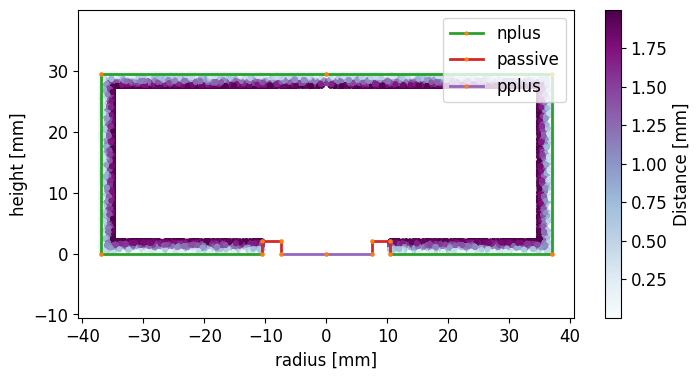
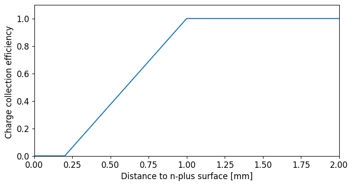
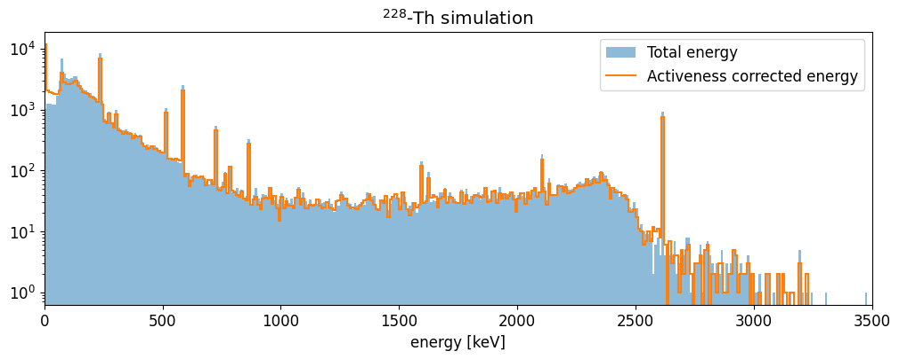
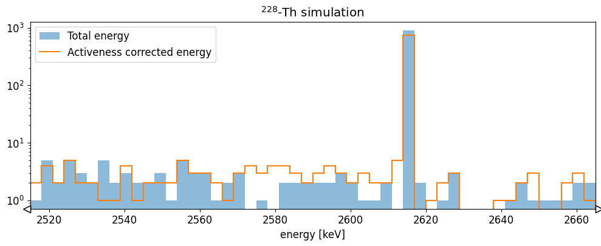
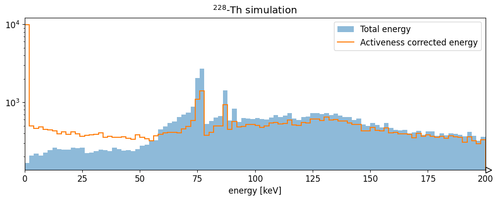
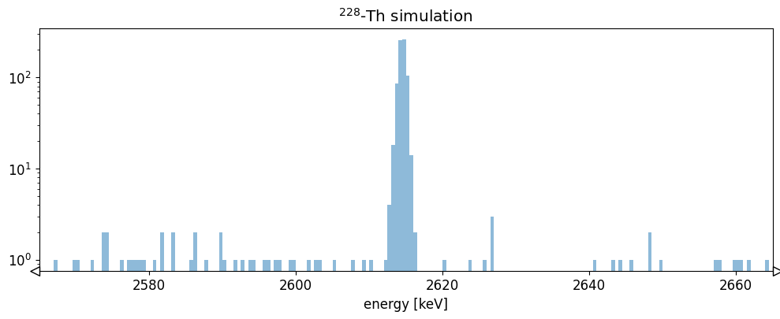
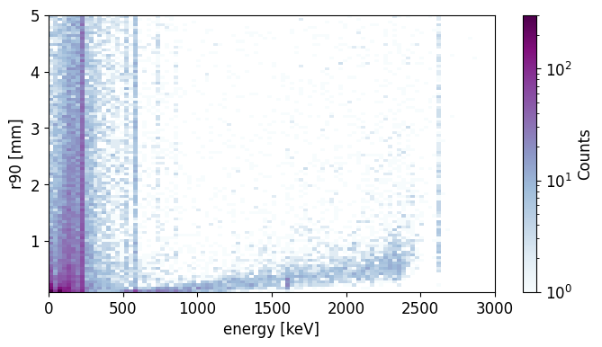
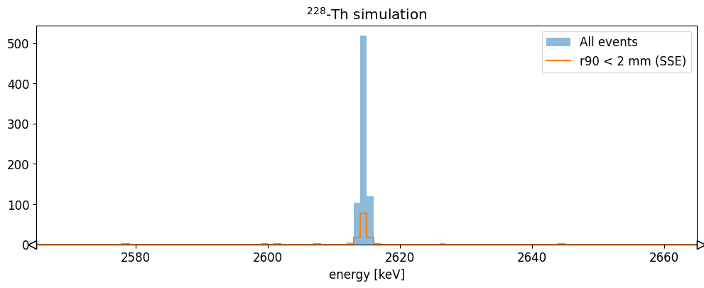
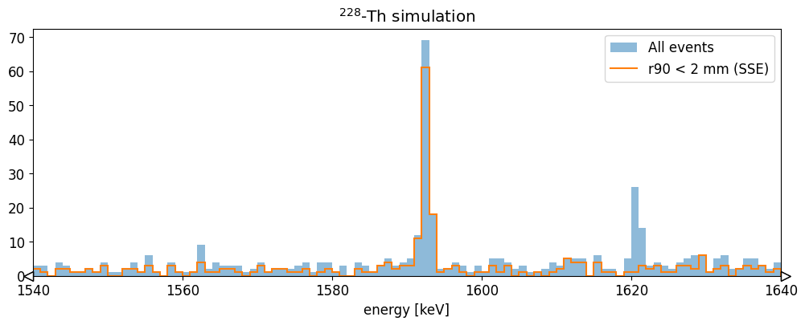
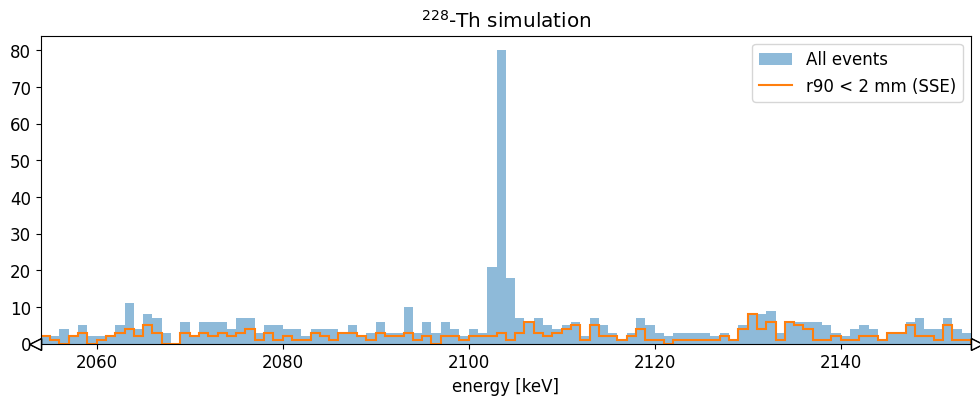

# Basic reboost post-processing in a python script

Simple post-processing of _remage_ simulations can be done in a python script
or notebook. This has some limitations but is very useful for simple tasks.
For more complicated tasks we have created a config file interface (see the
next tutorial). This tutorial builds on the [_remage_
tutorial](https://remage.readthedocs.io/en/stable/tutorial.html)) of two
Germanium detectors in a LAr orb with a source. It describes how to run
a simple post-processing with reboost tools, and explains the usual steps.

For this example we simulate $^{228}$Th in the source. We use the following
macro file (saved as `th228.mac`):

```
/RMG/Geometry/RegisterDetector Germanium BEGe 001
/RMG/Geometry/RegisterDetector Germanium Coax 002
/RMG/Geometry/RegisterDetector Scintillator LAr 003

/run/initialize
/RMG/Output/Germanium/DiscardPhotonsIfNoGermaniumEdep true
/RMG/Processes/Stepping/ResetInitialDecayTime true

/RMG/Generator/Confine Volume
/RMG/Generator/Confinement/SampleOnSurface false
/RMG/Generator/Confinement/Physical/AddVolume Source

# generator
/RMG/Generator/Select GPS
/gps/particle ion
/gps/energy 0 eV
/gps/ion 88 224 # 224-Ra
/process/had/rdm/nucleusLimits 208 224 81 88

/run/beamOn 1000000
```

And run the _remage_ (from inside the remage container / after installation
[[instructions]](https://remage.readthedocs.io/en/stable/manual/install.html))
simulation with:

```console
$ remage --threads 1 --gdml-files geometry.gdml --output stp_out.lh5 -- th228.mac
```

This should take about 10 minutes to run.

We should now have a _remage_ output file to use for our post-processing!

## Setup the environment

```python
from lgdo import lh5
from lgdo.types import Table, Array, VectorOfVectors
import numpy as np
from pygeomtools.detectors import get_sensvol_metadata
from legendhpges import make_hpge, draw
import legendhpges
import pyg4ometry
import awkward as ak
from reboost.math.stats import gaussian_sample
import hist
import matplotlib.pyplot as plt
import matplotlib.colors as mcolors

import reboost
from reboost import hpge
from reboost.hpge import surface, psd
from reboost.shape import group
from reboost.math import functions

plt.rcParams.update({"font.size": 12})
```

## Extract useful objects

Additional information is needed (for example details of the detector geometry)
to perform our post-processing. Fortunately for us integration with the
detector geometry GDML file makes this easy! Similarly to how
[pyg4ometry](https://pyg4ometry.readthedocs.io) was used to write the detector
geometry GDML file it can also be used to read this back into python. This GDML
file can also contain additional metadata useful for us, which can be extracted
using the [legend-pygeom-tools](https://legend-pygeom-tools.readthedocs.io) package.

This metadata can be used to create a python object describing the HPGe
detectors using the
[legend-pygeom-hpges](https://legend-pygeom-hpges.readthedocs.io) package.
Among other things them HPGe object from this package has methods to compute
detector properties (mass, surface area etc.) and to compute the distance of
points from the detector surface.

In this example we extract the _pyg4ometry.geant4.Registry_ object describing the geometry (see [[docs]](https://pyg4ometry.readthedocs.io/en/stable/autoapi/pyg4ometry/geant4/Registry/index.html#pyg4ometry.geant4.Registry.Registry), the _legend-pygeom-hpges_ HPGe python object [[docs]](https://legend-pygeom-hpges.readthedocs.io/en/stable/api/legendhpges.html#legendhpges.base.HPGe) and finally we extract the position of the BEGe detector (which we focus on for this analysis).

```python
reg = pyg4ometry.gdml.Reader("geometry.gdml").getRegistry()
hpge_pyobj = make_hpge(get_sensvol_metadata(reg, "BEGe"), registry=None)
position = reg.physicalVolumeDict["BEGe"].position.eval()
```

## Read the data

Next we can read the data using the
[[lgdo]](https://legend-pydataobj.readthedocs.io/en/stable/) package.

:::{warning}
If the simulations files are large this approach can cause memory issues, in
that case it is possible to iterate over the files instead using the
GLMIterator (see the next tutorial).
:::

We use the [[awkward]](https://awkward-array.org/doc/main/) package to view the
data, ideal for working with data with a "jagged" structure, i.e. many vectors
of different lengths.

```python
stp = lh5.read_as("stp/det001", "stp_out.lh5", "ak")
```

## Processors

:::{note}
If the _remage_ flat output file is used an additional step of "step-grouping" is required.
:::
Now we can compute some quantities based on our simulation. This is based on
"processors" (see the User manual for more details). This is just any
(generic) python function computing a new (post-processed) quantity (i.e. a new
row of the output table).

The only requirements are:

- the function should return an `LGDO.VectorOfVectors`, `LGDO.Array` or
  `LGDO.ArrayOfEqualSizedArrays`
  [[docs]](https://legend-pydataobj.readthedocs.io/en/latest/api/lgdo.types.html)
  object, or something able to be converted to this (awkward arrays for example),
- the returned object should have the same length as the original hits table,
  i.e. the processors act on every row but they cannot add, remove or merge
  rows.

### Active energy

One of the main steps in the post-processing of HPGe simulations consists of
correction for the inactive regions at the surface of the detector.

A common heuristic approach consists of computing the distance of each energy
deposition from the detector surface and then weighting the deposited energy by
an "activeness" function. One complication of this approach is that the
various surfaces (electrodes) of a Germanium detector do not have the same
thickness of inactive (commonly called "dead" layer).

_reboost_ contains a function to compute the distance of points to the surface
of the HPGe detector
[[docs]](https://reboost.readthedocs.io/en/stable/api/reboost.hpge.html#reboost-hpge-surface-module).

```python
dist_all = reboost.hpge.surface.distance_to_surface(
    hits.xloc * 1000, hits.yloc * 1000, hits.zloc * 1000, hpge_pyobj, position
).view_as("ak")

dist_nplus = reboost.hpge.surface.distance_to_surface(
    hits.xloc * 1000,
    hits.yloc * 1000,
    hits.zloc * 1000,
    hpge_pyobj,
    position,
    surface_type="nplus",
).view_as("ak")
```

We make a plot of the distance of the steps to the n+ electrode compared to the `r,z` coordinates.

```python
# extract r and z
r = ak.flatten(
    np.sqrt(
        (hits.xloc * 1000 - position[0]) ** 2 + (hits.yloc * 1000 - position[1]) ** 2
    )
)
z = ak.flatten(hits.zloc * 1000 - position[2])
rng = np.random.default_rng()
r = rng.choice([-1, 1], p=[0.5, 0.5], size=len(r)) * r

# make the plot
fig, ax = plt.subplots(figsize=(8, 4))
legendhpges.draw.plot_profile(hpge_pyobj, axes=ax, split_by_type=True)

cut = ak.flatten(dist_nplus) < 2
s = ax.scatter(
    r[cut],
    z[cut],
    c=ak.flatten(dist_nplus)[cut],
    marker=".",
    cmap="BuPu",
)
c = plt.colorbar(s)

# configure the plot
ax.axis("equal")
c.set_label("Distance [mm]")
ax.set_xlabel("radius [mm]")
ax.set_ylabel("height [mm]")
```

    Text(0, 0.5, 'height [mm]')



We can compute for every step the "activeness" or the charge collection
efficiency based on a simple piecewise linear model. This function is:

$$
f(d) = \begin{cases} 0 & d< f*l \\
\frac{d-f*l}{f-f*l} & t<d<f \\
1 & d> f \end{cases}
$$

where:

- f: is the full-charge-collection depth (FCCD),
- l: is the fraction fully dead

We first plot this function for nominal values of $f = 1$ mm and $l = 0.2$.

```python
fig, ax = plt.subplots(figsize=(8, 4))

ax.plot(
    np.linspace(0, 2, 1000),
    reboost.math.functions.piecewise_linear_activeness(
        np.linspace(0, 2, 1000), fccd=1, dlf=0.2
    ),
)
ax.set_xlabel("Distance to n-plus surface [mm]")
ax.set_ylabel("Charge collection efficiency ")
ax.set_xlim(0, 2)
ax.set_ylim(0, 1.1)
```

    (0.0, 1.1)



Finally, we compute the activeness for every step and extract the activeness
corrected energies, summing over the steps.

We then plot the energy spectra:

```python
activeness = reboost.math.functions.piecewise_linear_activeness(
    dist_all, fccd=1, dlf=0.4
)

# compute the energy
total_energy = ak.sum(hits.edep, axis=-1)
corr_energy = ak.sum(hits.edep * activeness, axis=-1)


# make a plot
def _make_plot(total, corr, xrange, bins, scale="log"):
    fig, ax = plt.subplots(figsize=(12, 4))
    h_total = hist.new.Reg(bins, *xrange, name="energy [keV]").Double().fill(total)
    h_corr = hist.new.Reg(bins, *xrange, name="energy [keV]").Double().fill(corr)
    ax.set_title("$^{228}$-Th simulation")

    h_total.plot(yerr=False, fill=True, alpha=0.5, label="Total energy")
    h_corr.plot(yerr=False, alpha=1, label="Activeness corrected energy")

    ax.set_xlim(*xrange)
    ax.legend()
    ax.set_yscale(scale)


_make_plot(total_energy, corr_energy, xrange=(0, 3500), bins=350)
_make_plot(total_energy, corr_energy, xrange=(2615 - 100, 2615 + 50), bins=50)
_make_plot(total_energy, corr_energy, xrange=(0, 200), bins=100)
```







The HPGe activeness correction shifts events out of the 2615 keV full energy
peak into the continuum. It also increases the number of hits with very low
energy (due to interactions in the dead-layer).

### Energy resolution smearing

The remage simulations do not include the effect of the energy resolution. To
do this there is a reboost processor to sample from a Gaussian distribution
[[docs]](https://reboost.readthedocs.io/en/stable/api/reboost.math.html#module-reboost.math.stats).

We demonstrate this with a sigma of 0.5 keV.

```python
energy_smeared = reboost.math.stats.gaussian_sample(corr_energy, sigma=0.5)

fig, ax = plt.subplots(figsize=(12, 4))
h_smear = (
    hist.new.Reg(200, 2615 - 50, 2615 + 50, name="energy [keV]")
    .Double()
    .fill(energy_smeared)
)
ax.set_title("$^{228}$-Th simulation")
h_smear.plot(yerr=False, fill=True, alpha=0.5, label="Total energy")

ax.set_xlim(2615 - 50, 2615 + 50)
ax.set_yscale("log")
```



This introduces a Gaussian spread to the energy spectrum.

### PSD heuristics - r90

Another area of HPGe post-processing involves the calculation of PSD
heuristics. These are quantities which help estimate if an event would have a
single or multi-site event topology.

One simple example is the `r90`, or the radius of a sphere (centered on the
event energy weighted center of mass), containing at-least 90% of the energy.

This can be computed with a simple `reboost` processor: {func}`.hpge.psd.r90`.

```python
r90 = reboost.hpge.psd.r90(
    hits.edep, hits.xloc * 1000, hits.yloc * 1000, hits.zloc * 1000
).view_as("ak")

# make a plot
fig, ax = plt.subplots(figsize=(8, 4))
_, _, _, im = ax.hist2d(
    energy_smeared,
    r90.to_numpy(),
    bins=100,
    range=[(0, 3000), (0.1, 5)],
    cmap="BuPu",
    norm=mcolors.LogNorm(),
)
cbar = plt.colorbar(im, label="Counts")
ax.set_xlabel("energy [keV]")
ax.set_ylabel("r90 [mm]")
```

    Text(0, 0.5, 'r90 [mm]')



The average `r90` generally increases through the energy spectra, as we expect.
Cutting on events with `r90` < 2 mm we can obtain a rough estimate of the
spectrum after the PSD cut.

```python
def _make_plot(energy, cut, xrange, bins, scale="log"):
    fig, ax = plt.subplots(figsize=(12, 4))
    h_total = hist.new.Reg(bins, *xrange, name="energy [keV]").Double().fill(energy)
    h_sse = hist.new.Reg(bins, *xrange, name="energy [keV]").Double().fill(energy[cut])
    ax.set_title("$^{228}$-Th simulation")

    h_total.plot(yerr=False, fill=True, alpha=0.5, label="All events")
    h_sse.plot(yerr=False, alpha=1, label="r90 < 2 mm (SSE)")

    ax.set_xlim(*xrange)
    ax.legend()
    ax.set_yscale(scale)


_make_plot(energy_smeared, r90 < 2, xrange=(0, 3500), bins=350)
_make_plot(
    energy_smeared, r90 < 2, xrange=(2615 - 50, 2615 + 50), bins=100, scale="linear"
)
_make_plot(
    energy_smeared, r90 < 2, xrange=(1590 - 50, 1590 + 50), bins=100, scale="linear"
)
_make_plot(
    energy_smeared, r90 < 2, xrange=(2104 - 50, 2104 + 50), bins=100, scale="linear"
)
```








We see that this basic cut removes most of the 2615 keV events, and the events
in the 2104 keV single escape peak, while keeping the 1588 keV double escape
peak almost unaffected. This is what we would expect. More sophisticated
heuristics are able to reproduce better the features of experimental data!

### Saving to disk

We can save the data to disk by appending the fields to the hit table.

```python
hits_tbl = Table(hits)

# add fields
hits_tbl.add_field("energy", Array(energy_smeared))
hits_tbl.add_field("r90", Array(r90))
hits_tbl.add_field("evtid", Array(ak.fill_none(ak.firsts(hits.evtid), np.nan)))
hits_tbl.add_field("t0", Array(ak.fill_none(ak.firsts(hits.time), np.nan)))

for field in ["particle", "edep", "time", "xloc", "yloc", "zloc", "dist_to_surf"]:
    hits_tbl.remove_field(field)
```

```python
lh5.write(hits_tbl, "hit/det001", "hit_out.lh5")
```

Now we have a hit tier file for further analysis!
